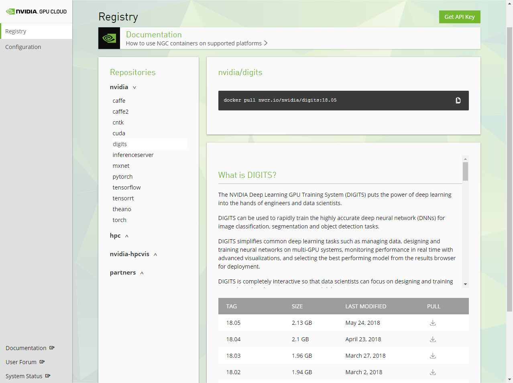
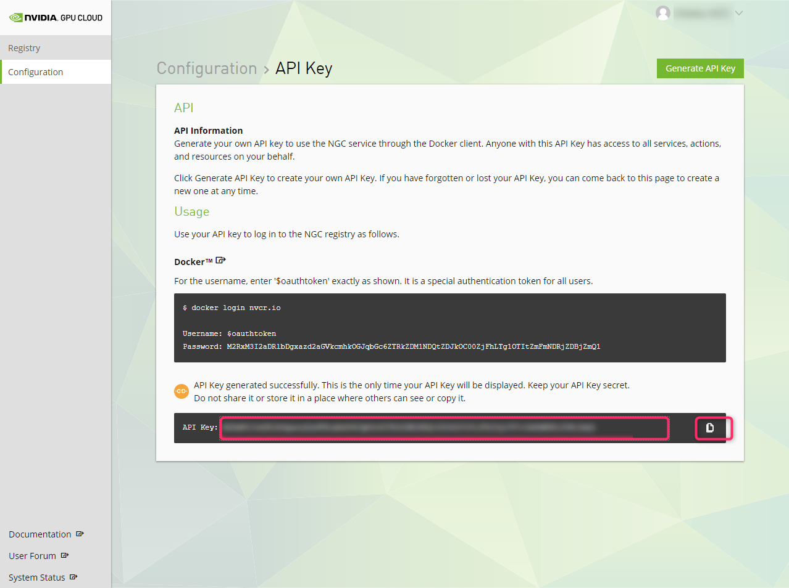

# Deploying Deep Learning
Welcome to our training guide for inference and [deep vision](https://rawgit.com/dusty-nv/jetson-inference/master/docs/html/index.html) runtime library for NVIDIA **[DIGITS](https://github.com/NVIDIA/DIGITS)** and **[Jetson Xavier/TX1/TX2](http://www.nvidia.com/object/embedded-systems.html)**.

This repo uses NVIDIA **[TensorRT](https://developer.nvidia.com/tensorrt)** for efficiently deploying neural networks onto the embedded platform, improving performance and power efficiency using graph optimizations, kernel fusion, and half-precision FP16 on the Jetson.

Vision primitives, such as [`imageNet`](imageNet.h) for image recognition, [`detectNet`](detectNet.h) for object localization, and [`segNet`](segNet.h) for segmentation, inherit from the shared [`tensorNet`](tensorNet.h) object.  Examples are provided for streaming from live camera feed and processing images from disk.  See the **[Deep Vision API Reference Specification](https://rawgit.com/dusty-nv/jetson-inference/master/docs/html/index.html)** for accompanying documentation. 


> &gt; &nbsp; See **[Image Segmentation](#image-segmentation-with-segnet)** models and training guide with aerial drone dataset. <br/>
> &gt; &nbsp; Try **[Object Detection](#locating-object-coordinates-using-detectnet)** training guide using DIGITS & MS-COCO training dataset. <br/>
> &gt; &nbsp; Use **[Image Recognition](#re-training-the-network-with-digits)** training guide with DIGITS & ImageNet ILSVRC12 dataset. <br/>
> &gt; &nbsp; Check out our next GitHub tutorial, **[Deep Reinforcement Learning in Robotics](http://github.com/dusty-nv/jetson-reinforcement)**. <br/>
> &gt; &nbsp; Jetson AGX Xavier Developer Kit and JetPack 4.1 EA is **[now available](https://news.developer.nvidia.com/nvidia-jetson-agx_xavier-developer-kit-now-available/)** and supported in the repo.

### **Table of Contents**

* [DIGITS Workflow](#digits-workflow) 
* [System Setup](#system-setup)
* [Building from Source on Jetson](#building-from-source-on-jetson)
* [Classifying Images with ImageNet](#classifying-images-with-imagenet)
	* [Using the Console Program on Jetson](#using-the-console-program-on-jetson)
	* [Running the Live Camera Recognition Demo](#running-the-live-camera-recognition-demo)
	* [Re-training the Network with DIGITS](#re-training-the-network-with-digits)
	* [Downloading Image Recognition Dataset](#downloading-image-recognition-dataset)
	* [Customizing the Object Classes](#customizing-the-object-classes)
	* [Importing Classification Dataset into DIGITS](#importing-classification-dataset-into-digits)
	* [Creating Image Classification Model with DIGITS](#creating-image-classification-model-with-digits)
	* [Testing Classification Model in DIGITS](#testing-classification-model-in-digits)
	* [Downloading Model Snapshot to Jetson](#downloading-model-snapshot-to-jetson)
	* [Loading Custom Models on Jetson](#loading-custom-models-on-jetson)
* [Locating Object Coordinates using DetectNet](#locating-object-coordinates-using-detectnet)
	* [Detection Data Formatting in DIGITS](#detection-data-formatting-in-digits)
	* [Downloading the Detection Dataset](#downloading-the-detection-dataset)
	* [Importing the Detection Dataset into DIGITS](#importing-the-detection-dataset-into-digits)
	* [Creating DetectNet Model with DIGITS](#creating-detectnet-model-with-digits)
	* [Testing DetectNet Model Inference in DIGITS](#testing-detectnet-model-inference-in-digits)
	* [Downloading the Model Snapshot to Jetson](#downloading-the-model-snapshot-to-jetson)
	* [DetectNet Patches for TensorRT](#detectnet-patches-for-tensorrt)
	* [Processing Images from the Command Line on Jetson](#processing-images-from-the-command-line-on-jetson)
	* [Multi-class Object Detection Models](#multi-class-object-detection-models)
	* [Running the Live Camera Detection Demo on Jetson](#running-the-live-camera-detection-demo-on-jetson)
* [Image Segmentation with SegNet](#image-segmentation-with-segnet)
	* [Downloading Aerial Drone Dataset](#downloading-aerial-drone-dataset)
	* [Importing the Aerial Dataset into DIGITS](#importing-the-aerial-dataset-into-digits)
	* [Generating Pretrained FCN-Alexnet](#generating-pretrained-fcn-alexnet)
	* [Training FCN-Alexnet with DIGITS](#training-fcn-alexnet-with-digits)
	* [Testing Inference Model in DIGITS](#testing-inference-model-in-digits)
	* [FCN-Alexnet Patches for TensorRT](#fcn-alexnet-patches-for-tensorrt)
	* [Running Segmentation Models on Jetson](#running-segmentation-models-on-jetson)

**Recommended System Requirements**

Training GPU:  Maxwell, Pascal, or Volta-based GPU (ideally with at least 6GB video memory)  
&nbsp;&nbsp;&nbsp;&nbsp;&nbsp;&nbsp;&nbsp;&nbsp;&nbsp;&nbsp;&nbsp;&nbsp;&nbsp;&nbsp;&nbsp;&nbsp;&nbsp;&nbsp;&nbsp;&nbsp;&nbsp;&nbsp;&nbsp;&nbsp;optionally, AWS P2/P3 instance or Microsoft Azure N-series  
&nbsp;&nbsp;&nbsp;&nbsp;&nbsp;&nbsp;&nbsp;&nbsp;&nbsp;&nbsp;&nbsp;&nbsp;&nbsp;&nbsp;&nbsp;&nbsp;&nbsp;&nbsp;&nbsp;&nbsp;&nbsp;&nbsp;&nbsp;&nbsp;Ubuntu 14.04 x86_64 or Ubuntu 16.04 x86_64.

Deployment:    &nbsp;&nbsp;Jetson Xavier Developer Kit with JetPack 4.0 DP EA (Ubuntu 18.04 aarch64).  
&nbsp;&nbsp;&nbsp;&nbsp;&nbsp;&nbsp;&nbsp;&nbsp;&nbsp;&nbsp;&nbsp;&nbsp;&nbsp;&nbsp;&nbsp;&nbsp;&nbsp;&nbsp;&nbsp;&nbsp;&nbsp;&nbsp;&nbsp;&nbsp;Jetson TX2 Developer Kit with JetPack 3.0 or newer (Ubuntu 16.04 aarch64).  
&nbsp;&nbsp;&nbsp;&nbsp;&nbsp;&nbsp;&nbsp;&nbsp;&nbsp;&nbsp;&nbsp;&nbsp;&nbsp;&nbsp;&nbsp;&nbsp;&nbsp;&nbsp;&nbsp;&nbsp;&nbsp;&nbsp;&nbsp;&nbsp;Jetson TX1 Developer Kit with JetPack 2.3 or newer (Ubuntu 16.04 aarch64).

> **note**:  this [branch](http://github.com/dusty-nv/jetson-inference) is verified against the following BSP versions for Jetson AGX Xavier and Jetson TX1/TX2: <br/>
> &nbsp;&nbsp;&nbsp;&nbsp;&nbsp;&nbsp;&nbsp;&nbsp;&nbsp;&nbsp;&nbsp;&nbsp;&nbsp;> Jetson AGX Xavier - JetPack 4.1 DP EA / L4T R31.0.2 aarch64 (Ubuntu 18.04 LTS) inc. TensorRT 5.0 RC<br/>
> &nbsp;&nbsp;&nbsp;&nbsp;&nbsp;&nbsp;&nbsp;&nbsp;&nbsp;&nbsp;&nbsp;&nbsp;&nbsp;> Jetson AGX Xavier - JetPack 4.0 DP EA / L4T R31.0.1 aarch64 (Ubuntu 18.04 LTS) inc. TensorRT 5.0 RC<br/>
> &nbsp;&nbsp;&nbsp;&nbsp;&nbsp;&nbsp;&nbsp;&nbsp;&nbsp;&nbsp;&nbsp;&nbsp;&nbsp;> Jetson TX2 - JetPack 3.3 / L4T R28.2.1 aarch64 (Ubuntu 16.04 LTS) inc. TensorRT 4.0<br/>
> &nbsp;&nbsp;&nbsp;&nbsp;&nbsp;&nbsp;&nbsp;&nbsp;&nbsp;&nbsp;&nbsp;&nbsp;&nbsp;> Jetson TX1 - JetPack 3.3 / L4T R28.2 aarch64 (Ubuntu 16.04 LTS) inc. TensorRT 4.0<br/>
> &nbsp;&nbsp;&nbsp;&nbsp;&nbsp;&nbsp;&nbsp;&nbsp;&nbsp;&nbsp;&nbsp;&nbsp;&nbsp;> Jetson TX2 - JetPack 3.2 / L4T R28.2 aarch64 (Ubuntu 16.04 LTS) inc. TensorRT 3.0 <br/>
> &nbsp;&nbsp;&nbsp;&nbsp;&nbsp;&nbsp;&nbsp;&nbsp;&nbsp;&nbsp;&nbsp;&nbsp;&nbsp;> Jetson TX2 - JetPack 3.1 / L4T R28.1 aarch64 (Ubuntu 16.04 LTS) inc. TensorRT 3.0 RC <br/>
> &nbsp;&nbsp;&nbsp;&nbsp;&nbsp;&nbsp;&nbsp;&nbsp;&nbsp;&nbsp;&nbsp;&nbsp;&nbsp;> Jetson TX1 - JetPack 3.1 / L4T R28.1 aarch64 (Ubuntu 16.04 LTS) inc. TensorRT 3.0 RC <br/>
> &nbsp;&nbsp;&nbsp;&nbsp;&nbsp;&nbsp;&nbsp;&nbsp;&nbsp;&nbsp;&nbsp;&nbsp;&nbsp;> Jetson TX2 - JetPack 3.1 / L4T R28.1 aarch64 (Ubuntu 16.04 LTS) inc. TensorRT 2.1<br/>
> &nbsp;&nbsp;&nbsp;&nbsp;&nbsp;&nbsp;&nbsp;&nbsp;&nbsp;&nbsp;&nbsp;&nbsp;&nbsp;> Jetson TX1 - JetPack 3.1 / L4T R28.1 aarch64 (Ubuntu 16.04 LTS) inc. TensorRT 2.1<br/>
> &nbsp;&nbsp;&nbsp;&nbsp;&nbsp;&nbsp;&nbsp;&nbsp;&nbsp;&nbsp;&nbsp;&nbsp;&nbsp;> Jetson TX2 - JetPack 3.0 / L4T R27.1 aarch64 (Ubuntu 16.04 LTS) inc. TensorRT 1.0<br/>
> &nbsp;&nbsp;&nbsp;&nbsp;&nbsp;&nbsp;&nbsp;&nbsp;&nbsp;&nbsp;&nbsp;&nbsp;&nbsp;> Jetson TX1 - JetPack 2.3 / L4T R24.2 aarch64 (Ubuntu 16.04 LTS) inc. TensorRT 1.0<br/>
> &nbsp;&nbsp;&nbsp;&nbsp;&nbsp;&nbsp;&nbsp;&nbsp;&nbsp;&nbsp;&nbsp;&nbsp;&nbsp;> Jetson TX1 - JetPack 2.3.1 / L4T R24.2.1 aarch64 (Ubuntu 16.04 LTS)

Note that TensorRT samples from the repo are intended for deployment on embedded Jetson TX1/TX2 module, however when cuDNN and TensorRT have been installed on the host side, the TensorRT samples in the repo can be compiled for PC.

## DIGITS Workflow

New to deep neural networks (DNNs) and machine learning?  Take this [introductory primer](docs/deep-learning.md) on training and inference.

<a href="https://github.com/dusty-nv/jetson-inference/blob/master/docs/deep-learning.md"></a>

Using NVIDIA deep learning tools, it's easy to **[Get Started](https://github.com/NVIDIA/DIGITS/blob/master/docs/GettingStarted.md)** training DNNs and deploying them into the field with high performance.  Discrete GPUs are typically used in a server, PC, or laptop for training with DIGITS, while Jetson and integrated GPU is used in embedded form factors.

<a href="https://github.com/dusty-nv/jetson-inference/blob/master/docs/deep-learning.md"></a>

NVIDIA [DIGITS](https://github.com/NVIDIA/DIGITS) is used to interactively train network models on annotated datasets in the cloud or PC, while TensorRT and Jetson are used to deploy runtime inference in the field. TensorRT uses graph optimizations and half-precision FP16 support to more than double DNN inferencing.  Together, DIGITS and TensorRT form an effective workflow for developing and deploying deep neural networks capable of implementing advanced AI and perception. 

## System Setup

During this tutorial, we'll use a host PC (or cloud instance) for training DNNs, alongside a Jetson for inference.  

Due to the number of dependencies required for training, it's recommended for beginners to setup their host training PC with **[NVIDIA GPU Cloud (NGC)](https://www.nvidia.com/en-us/gpu-cloud/)** or [nvidia-docker](https://github.com/NVIDIA/nvidia-docker).  These methods automate the install of the drivers and machine learning frameworks on the host.  NGC can be used to deploy Docker images locally, or remotely to cloud providers like AWS or Azure N-series.

A host PC will also serve to flash the Jetson with the latest JetPack.  First, we'll setup and configure the host PC with the required OS and tools.

### Installing Ubuntu on the Host

Download and install Ubuntu 16.04 x86_64 onto the host PC from one of the following locations:

```
http://releases.ubuntu.com/16.04/ubuntu-16.04.2-desktop-amd64.iso
http://releases.ubuntu.com/16.04/ubuntu-16.04.2-desktop-amd64.iso.torrent
```

Ubuntu 14.04 x86_64 may also be acceptable with minor modifications later while installing some packages with apt-get.

### Running JetPack on the Host

Download the latest **[JetPack](https://developer.nvidia.com/embedded/jetpack)** to the host PC.  In addition to flashing the Jetson with the latest Board Support Package (BSP), JetPack automatically installs tools for the host like CUDA Toolkit.  See the JetPack [Release Notes](https://developer.nvidia.com/embedded/jetpack-notes) for the full list of features and installed packages.

After downloading JetPack from the link above, run it from the host PC with the following commands:

``` bash 
$ cd <directory where you downloaded JetPack>
$ chmod +x JetPack-L4T-<version>-linux-x64.run 
$ ./JetPack-L4T-<version>-linux-x64.run 
```

The JetPack GUI will start.  Follow the step-by-step **[Install Guide](http://docs.nvidia.com/jetpack-l4t/index.html#developertools/mobile/jetpack/l4t/3.0/jetpack_l4t_install.htm)** to complete the setup.  Near the beginning, JetPack will confirm which generation Jetson you are developing for.


Select Jetson TX1 if you are using TX1, or Jetson TX2 if you're using TX2, and press `Next` to continue.

The next screen will list the packages available to be installed.  The packages installed to the host are listed at the top under the `Host - Ubuntu` dropdown, while those intended for the Jetson are shown near the bottom.  You can select or deselect an individual package for installation by clicking it's `Action` column.


Since CUDA will be used on the host for training DNNs, it's recommended to select the Full install by click on the radio button in the top right.  Then press `Next` to begin setup.  JetPack will download and then install the sequence of packages.  Note that all the .deb packages are stored under the `jetpack_downloads` subdirectory if you are to need them later.  

After the downloads have finished installing, JetPack will enter the post-install phase where the JetPack is flashed with the L4T BSP.  You'll need to connect your Jetson to your host PC via the micro-USB port and cable included in the devkit.  Then enter your Jetson into recovery mode by holding down the Recovery button while pressing and releasing Reset.  If you type `lsusb` from the host PC after you've connected the micro-USB cable and entered the Jetson into recovery mode, you should see the NVIDIA device come up under the list of USB devices.  JetPack uses the micro-USB connection from the host to flash the L4T BSP to the Jetson.  

After flashing, the Jetson will reboot and if attached to an HDMI display, will boot up to the Ubuntu desktop.  After this, JetPack connects to the Jetson from the host via SSH to install additional packages to the Jetson, like the ARM aarch64 builds of CUDA Toolkit, cuDNN, and TensorRT.  For JetPack to be able to reach the Jetson via SSH, the host PC should be networked to the Jetson via Ethernet.  This can be accomplished by running an Ethernet cable directly from the host to the Jetson, or by connecting both devices to a router or switch — the JetPack GUI will ask you to confirm which networking scenario is being used.  See the JetPack **[Install Guide](http://docs.nvidia.com/jetpack-l4t/index.html#developertools/mobile/jetpack/l4t/3.0/jetpack_l4t_install.htm)** for the full directions for installing JetPack and flashing Jetson.


### Setting up host training PC with NGC container	

> **note**:  if you're setting up DIGITS natively on your host PC, you should skip ahead to [`Natively setting up DIGITS on the Host`](#natively-setting-up-digits-on-the-host)  

NVIDIA hosts NVIDIA® GPU Cloud (NGC) container registry for AI developers worldwide.
You can download a containerized software stack for a wide range of deep learning frameworks, optimized and verified with NVIDIA libraries and CUDA runtime version.



If you have a recent generation GPU (Pascal or newer) on your PC, the use of NGC registry container is probably the easiest way to setup DIGITS.
To use a NGC registry container on your local host machine (as opposed to cloud), you can follow this detailed [setup guide](https://docs.nvidia.com/ngc/ngc-titan-setup-guide/index.html).

#### Installing the NVIDIA driver

Add the NVIDIA Developer repository and install the NVIDIA driver.

``` bash
$ sudo apt-get install -y apt-transport-https curl
$ cat <<EOF | sudo tee /etc/apt/sources.list.d/cuda.list > /dev/null
deb https://developer.download.nvidia.com/compute/cuda/repos/ubuntu1604/x86_64 /
EOF
$ curl -s \
 https://developer.download.nvidia.com/compute/cuda/repos/ubuntu1604/x86_64/7fa2af80.pub \
 | sudo apt-key add -
$ cat <<EOF | sudo tee /etc/apt/preferences.d/cuda > /dev/null
Package: *
Pin: origin developer.download.nvidia.com
Pin-Priority: 600
EOF
$ sudo apt-get update && sudo apt-get install -y --no-install-recommends cuda-drivers
$ sudo reboot
```

After reboot, check if you can run `nvidia-smi` and see if your GPU shows up.

``` bash
$ nvidia-smi
Thu May 31 11:56:44 2018
+-----------------------------------------------------------------------------+
| NVIDIA-SMI 390.30                 Driver Version: 390.30                    |
|-------------------------------+----------------------+----------------------+
| GPU  Name        Persistence-M| Bus-Id        Disp.A | Volatile Uncorr. ECC |
| Fan  Temp  Perf  Pwr:Usage/Cap|         Memory-Usage | GPU-Util  Compute M. |
|===============================+======================+======================|
|   0  Quadro GV100        Off  | 00000000:01:00.0  On |                  Off |
| 29%   41C    P2    27W / 250W |   1968MiB / 32506MiB |     22%      Default |
+-------------------------------+----------------------+----------------------+

```

#### Installing Docker

Install prerequisites, install the GPG key, and add the Docker repository.

``` bash
$ sudo apt-get install -y ca-certificates curl software-properties-common
$ curl -fsSL https://download.docker.com/linux/ubuntu/gpg | sudo apt-key add -
$ sudo add-apt-repository \
 "deb [arch=amd64] https://download.docker.com/linux/ubuntu $(lsb_release -cs) stable"
```

Add the Docker Engine Utility (nvidia-docker2) repository, install nvidia-docker2, set up permissions to use Docker without sudo each time, and then reboot the system.

``` bash
$ curl -s -L https://nvidia.github.io/nvidia-docker/gpgkey | \
  sudo apt-key add -
$ ccurl -s -L https://nvidia.github.io/nvidia-docker/ubuntu16.04/amd64/nvidia-docker.list | \
  sudo tee /etc/apt/sources.list.d/nvidia-docker.list
$ csudo apt-get update
$ csudo apt-get install -y nvidia-docker2
$ csudo usermod -aG docker $USER
$ sudo reboot
```

#### NGC Sign-up 

Sign up to NGC if you have not.

https://ngc.nvidia.com/signup/register

Generate your API key, and save it somewhere safe. You will use this soon later.



#### Setting up data and job directory for DIGITS

Back on you PC (after reboot), log in to the NGC container registry

``` bash
$ docker login nvcr.io
```

You will be prompted to enter Username and Password

``` bash
Username: $oauthtoken
Password: <Your NGC API Key>
```

For a test, use CUDA container to see if the nvidia-smi shows your GPU.

``` bash
docker run --runtime=nvidia --rm nvcr.io/nvidia/cuda:9.0-cudnn7-devel-ubuntu16.04 nvidia-smi
```

#### Setting up data and job directories

Create data and job directories on your host PC, to be mounted by DIGITS container.

``` bash
$ mkdir /home/username/data
$ mkdir /home/username/digits-jobs
```

#### Starting DIGITS container

``` bash
$ nvidia-docker run --name digits -d -p 8888:5000 \
 -v /home/username/data:/data:ro
 -v /home/username/digits-jobs:/workspace/jobs nvcr.io/nvidia/digits:18.05
```

Open up a web browser and access http://localhost:8888 .

### Natively setting up DIGITS on the Host 

> **note**:  if you're using [NVIDIA GPU Cloud (NGC)](https://www.nvidia.com/en-us/gpu-cloud/), you can skip ahead to [`Building from Source on Jetson`](#building-from-source-on-jetson)  

If you chose not to use NGC container for DIGITS, you need to natively set up your CUDA development environment on your PC and build DIGITS.

#### Installing NVIDIA Driver on the Host

At this point, JetPack will have flashed the Jetson with the latest L4T BSP, and installed CUDA toolkits to both the Jetson and host PC.  However, the NVIDIA PCIe driver will still need to be installed on the host PC to enable GPU-accelerated training.  Run the following commands from the host PC to install the NVIDIA driver from the Ubuntu repo:

``` bash
$ sudo apt-get install nvidia-384	# use nvidia-375 for alternate version
$ sudo reboot
```

Afer rebooting, the NVIDIA driver should be listed under `lsmod`:

``` bash
$ lsmod | grep nvidia
nvidia_uvm            647168  0
nvidia_drm             49152  1
nvidia_modeset        790528  4 nvidia_drm
nvidia              12144640  60 nvidia_modeset,nvidia_uvm
drm_kms_helper        167936  1 nvidia_drm
drm                   368640  4 nvidia_drm,drm_kms_helper
```

To verify the CUDA toolkit and NVIDIA driver are working, run some tests that come with the CUDA samples:

``` bash
$ cd /usr/local/cuda/samples
$ sudo make
$ cd bin/x86_64/linux/release/
$ ./deviceQuery
$ ./bandwidthTest --memory=pinned
```

#### Installing cuDNN on the Host

The next step is to install NVIDIA **[cuDNN](https://developer.nvidia.com/cudnn)** libraries on the host PC.  Download the libcudnn and libcudnn packages from the NVIDIA cuDNN webpage:

[`https://developer.nvidia.com/cudnn`](https://developer.nvidia.com/cudnn)

Then install the packages with the following commands:

``` bash
$ sudo dpkg -i libcudnn<version>_amd64.deb
$ sudo dpkg -i libcudnn-dev_<version>_amd64.deb
```

#### Installing NVcaffe on the Host

[NVcaffe](https://github.com/nvidia/caffe/tree/caffe-0.15) is the NVIDIA branch of Caffe with optimizations for GPU.  NVcaffe requires cuDNN and is used by DIGITS for training DNNs.  To install it, clone the NVcaffe repo from GitHub, and compile from source, using the caffe-0.15 branch.

> **note**: for this tutorial, NVcaffe is only required on the host (for training).  During inferencing phase TensorRT is used on the Jetson and doesn't require caffe.

First clone the caffe-0.15 branch from https://github.com/NVIDIA/caffe

``` bash
$ git clone -b caffe-0.15 https://github.com/NVIDIA/caffe
```

Build caffe with the [instructions](http://caffe.berkeleyvision.org/installation.html#compilation) from here:

[`http://caffe.berkeleyvision.org/installation.html#compilation`](http://caffe.berkeleyvision.org/installation.html#compilation)

Caffe should now be configured and built.  Now edit your user's ~/.bashrc to include the path to your Caffe tree (replace the paths below to reflect your own):

``` bash
export CAFFE_ROOT=/home/dusty/workspace/caffe
export PYTHONPATH=/home/dusty/workspace/caffe/python:$PYTHONPATH
```

Close and re-open the terminal for the changes to take effect.


#### Installing DIGITS on the Host

NVIDIA **[DIGITS](https://developer.nvidia.com/digits)** is a Python-based web service which interactively trains DNNs and manages datasets.  As highlighed in the DIGITS workflow, it runs on the host PC to create the network model during the training phase.  The trained model is then copied from the host PC to the Jetson for the runtime inference phase with TensorRT.

For automated installation, it's recommended to use DIGITS through [NVIDIA GPU Cloud](https://www.nvidia.com/en-us/gpu-cloud/), which comes with a DIGITS Docker image that can run on a GPU attached to a local PC or cloud instance. Alternatively, to install DIGITS from source, first clone the DIGITS repo from GitHub:

``` bash
$ git clone https://github.com/nvidia/DIGITS
```

Then complete the steps under the **[Building DIGITS](https://github.com/NVIDIA/DIGITS/blob/digits-6.0/docs/BuildDigits.md)** documentation.

[`https://github.com/NVIDIA/DIGITS/blob/digits-6.0/docs/BuildDigits.md`](https://github.com/NVIDIA/DIGITS/blob/digits-6.0/docs/BuildDigits.md)

#### Starting the DIGITS Server

Assuming that your terminal is still in the DIGITS directory, the webserver can be started by running the `digits-devserver` Python script:

``` bash
$ ./digits-devserver 
  ___ ___ ___ ___ _____ ___
 |   \_ _/ __|_ _|_   _/ __|
 | |) | | (_ || |  | | \__ \
 |___/___\___|___| |_| |___/ 5.1-dev

2017-04-17 13:19:02 [INFO ] Loaded 0 jobs.`
```

DIGITS will store user jobs (training datasets and model snapshots) under the `digits/jobs` directory.

To access the interactive DIGITS session, open your web browser and navigate to `0.0.0.0:5000`.

> **note**:  by default the DIGITS server will start on port 5000, but the port can be specified by passing the `--port` argument to the `digits-devserver` script.


## Building from Source on Jetson
Provided along with this repo are TensorRT-enabled deep learning primitives for running Googlenet/Alexnet on live camera feed for image recognition, pedestrian detection networks with localization capabilities (i.e. that provide bounding boxes), and segmentation.  This repo is intended to be built & run on the Jetson and to accept the network models from the host PC trained on the DIGITS server.

The latest source can be obtained from [GitHub](http://github.com/dusty-nv/jetson-inference) and compiled onboard Jetson AGX Xavier and Jetson TX1/TX2.

> **note**:  this [branch](http://github.com/dusty-nv/jetson-inference) is verified against the following BSP versions for Jetson AGX Xavier and Jetson TX1/TX2: <br/>
> &nbsp;&nbsp;&nbsp;&nbsp;&nbsp;&nbsp;&nbsp;&nbsp;&nbsp;&nbsp;&nbsp;&nbsp;&nbsp;> Jetson AGX Xavier - JetPack 4.1 DP EA / L4T R31.0.2 aarch64 (Ubuntu 18.04 LTS) inc. TensorRT 5.0 RC<br/>
> &nbsp;&nbsp;&nbsp;&nbsp;&nbsp;&nbsp;&nbsp;&nbsp;&nbsp;&nbsp;&nbsp;&nbsp;&nbsp;> Jetson AGX Xavier - JetPack 4.0 DP EA / L4T R31.0.1 aarch64 (Ubuntu 18.04 LTS) inc. TensorRT 5.0 RC<br/>
> &nbsp;&nbsp;&nbsp;&nbsp;&nbsp;&nbsp;&nbsp;&nbsp;&nbsp;&nbsp;&nbsp;&nbsp;&nbsp;> Jetson TX2 - JetPack 3.3 / L4T R28.2.1 aarch64 (Ubuntu 16.04 LTS) inc. TensorRT 4.0<br/>
> &nbsp;&nbsp;&nbsp;&nbsp;&nbsp;&nbsp;&nbsp;&nbsp;&nbsp;&nbsp;&nbsp;&nbsp;&nbsp;> Jetson TX1 - JetPack 3.3 / L4T R28.2 aarch64 (Ubuntu 16.04 LTS) inc. TensorRT 4.0<br/>
> &nbsp;&nbsp;&nbsp;&nbsp;&nbsp;&nbsp;&nbsp;&nbsp;&nbsp;&nbsp;&nbsp;&nbsp;&nbsp;> Jetson TX2 - JetPack 3.2 / L4T R28.2 aarch64 (Ubuntu 16.04 LTS) inc. TensorRT 3.0 <br/>
> &nbsp;&nbsp;&nbsp;&nbsp;&nbsp;&nbsp;&nbsp;&nbsp;&nbsp;&nbsp;&nbsp;&nbsp;&nbsp;> Jetson TX2 - JetPack 3.1 / L4T R28.1 aarch64 (Ubuntu 16.04 LTS) inc. TensorRT 3.0 RC <br/>
> &nbsp;&nbsp;&nbsp;&nbsp;&nbsp;&nbsp;&nbsp;&nbsp;&nbsp;&nbsp;&nbsp;&nbsp;&nbsp;> Jetson TX1 - JetPack 3.1 / L4T R28.1 aarch64 (Ubuntu 16.04 LTS) inc. TensorRT 3.0 RC <br/>
> &nbsp;&nbsp;&nbsp;&nbsp;&nbsp;&nbsp;&nbsp;&nbsp;&nbsp;&nbsp;&nbsp;&nbsp;&nbsp;> Jetson TX2 - JetPack 3.1 / L4T R28.1 aarch64 (Ubuntu 16.04 LTS) inc. TensorRT 2.1<br/>
> &nbsp;&nbsp;&nbsp;&nbsp;&nbsp;&nbsp;&nbsp;&nbsp;&nbsp;&nbsp;&nbsp;&nbsp;&nbsp;> Jetson TX1 - JetPack 3.1 / L4T R28.1 aarch64 (Ubuntu 16.04 LTS) inc. TensorRT 2.1<br/>
> &nbsp;&nbsp;&nbsp;&nbsp;&nbsp;&nbsp;&nbsp;&nbsp;&nbsp;&nbsp;&nbsp;&nbsp;&nbsp;> Jetson TX2 - JetPack 3.0 / L4T R27.1 aarch64 (Ubuntu 16.04 LTS) inc. TensorRT 1.0<br/>
> &nbsp;&nbsp;&nbsp;&nbsp;&nbsp;&nbsp;&nbsp;&nbsp;&nbsp;&nbsp;&nbsp;&nbsp;&nbsp;> Jetson TX1 - JetPack 2.3 / L4T R24.2 aarch64 (Ubuntu 16.04 LTS) inc. TensorRT 1.0<br/>
> &nbsp;&nbsp;&nbsp;&nbsp;&nbsp;&nbsp;&nbsp;&nbsp;&nbsp;&nbsp;&nbsp;&nbsp;&nbsp;> Jetson TX1 - JetPack 2.3.1 / L4T R24.2.1 aarch64 (Ubuntu 16.04 LTS)

      
#### Cloning the Repo
To obtain the repository, navigate to a folder of your choosing on the Jetson.  First, make sure git and cmake are installed locally:

``` bash
$ sudo apt-get install git cmake
```

Then clone the jetson-inference repo:
``` bash
$ git clone https://github.com/dusty-nv/jetson-inference
```

#### Configuring with CMake

When cmake is run, a special pre-installation script (CMakePreBuild.sh) is run and will automatically install any dependencies.

``` bash
$ cd jetson-inference
$ mkdir build
$ cd build
$ cmake ../
```

> **note**: the cmake command will launch the CMakePrebuild.sh script which asks for sudo while making sure prerequisite packages have been installed on the Jetson. The script also downloads the network model snapshots from web services.

#### Compiling the Project

Make sure you are still in the jetson-inference/build directory, created above in step #2.

``` bash
$ cd jetson-inference/build			# omit if pwd is already /build from above
$ make
```

Depending on architecture, the package will be built to either armhf or aarch64, with the following directory structure:

```
|-build
   \aarch64		    (64-bit)
      \bin			where the sample binaries are built to
      \include		where the headers reside
      \lib			where the libraries are build to
   \armhf           (32-bit)
      \bin			where the sample binaries are built to
      \include		where the headers reside
      \lib			where the libraries are build to
```

binaries residing in aarch64/bin, headers in aarch64/include, and libraries in aarch64/lib.

#### Digging Into the Code

For reference, see the available vision primitives, including [`imageNet`](imageNet.h) for image recognition and [`detectNet`](detectNet.h) for object localization.

``` c++
/**
 * Image recognition with GoogleNet/Alexnet or custom models, using TensorRT.
 */
class imageNet : public tensorNet
{
public:
	/**
	 * Network choice enumeration.
	 */
	enum NetworkType
	{
		ALEXNET,
		GOOGLENET
	};

	/**
	 * Load a new network instance
	 */
	static imageNet* Create( NetworkType networkType=GOOGLENET );
	
	/**
	 * Load a new network instance
	 * @param prototxt_path File path to the deployable network prototxt
	 * @param model_path File path to the caffemodel
	 * @param mean_binary File path to the mean value binary proto
	 * @param class_info File path to list of class name labels
	 * @param input Name of the input layer blob.
	 */
	static imageNet* Create( const char* prototxt_path, const char* model_path, const char* mean_binary,
							 const char* class_labels, const char* input="data", const char* output="prob" );

	/**
	 * Determine the maximum likelihood image class.
	 * @param rgba float4 input image in CUDA device memory.
	 * @param width width of the input image in pixels.
	 * @param height height of the input image in pixels.
	 * @param confidence optional pointer to float filled with confidence value.
	 * @returns Index of the maximum class, or -1 on error.
	 */
	int Classify( float* rgba, uint32_t width, uint32_t height, float* confidence=NULL );
};
```

Both inherit from the shared [`tensorNet`](tensorNet.h) object which contains common TensorRT code.

## Classifying Images with ImageNet
There are multiple types of deep learning networks available, including recognition, detection/localization, and soon segmentation.  The first deep learning capability we're highlighting in this tutorial is **image recognition** using an 'imageNet' that's been trained to identify similar objects.

The [`imageNet`](imageNet.h) object accepts an input image and outputs the probability for each class.  Having been trained on ImageNet database of **[1000 objects](data/networks/ilsvrc12_synset_words.txt)**, the standard AlexNet and GoogleNet networks are downloaded during [step 2](#configuring-with-cmake) from above.  As examples of using [`imageNet`](imageNet.h) we provide a command-line interface called [`imagenet-console`](imagenet-console/imagenet-console.cpp) and a live camera program called [`imagenet-camera`](imagenet-camera/imagenet-camera.cpp).

### Using the Console Program on Jetson

First, try using the [`imagenet-console`](imagenet-console/imagenet-console.cpp) program to test imageNet recognition on some example images.  It loads an image, uses TensorRT and the [`imageNet`](imageNet.h) class to perform the inference, then overlays the classification and saves the output image.

After [building](#building-from-source-on-jetson), make sure your terminal is located in the aarch64/bin directory:

``` bash
$ cd jetson-inference/build/aarch64/bin
```

Then, classify an example image with the [`imagenet-console`](imagenet-console/imagenet-console.cpp) program.  [`imagenet-console`](imagenet-console/imagenet-console.cpp) accepts 2 command-line arguments:  the path to the input image and path to the output image (with the class overlay printed).

``` bash
$ ./imagenet-console orange_0.jpg output_0.jpg
```


``` bash
$ ./imagenet-console granny_smith_1.jpg output_1.jpg
```


Next, we will use [imageNet](imageNet.h) to classify a live video feed from the Jetson onboard camera.

### Running the Live Camera Recognition Demo

Similar to the last example, the realtime image recognition demo is located in /aarch64/bin and is called [`imagenet-camera`](imagenet-camera/imagenet-camera.cpp).
It runs on live camera stream and depending on user arguments, loads googlenet or alexnet with TensorRT. 
``` bash
$ ./imagenet-camera googlenet           # to run using googlenet
$ ./imagenet-camera alexnet             # to run using alexnet
```

The frames per second (FPS), classified object name from the video, and confidence of the classified object are printed to the openGL window title bar.  By default the application can recognize up to 1000 different types of objects, since Googlenet and Alexnet are trained on the ILSVRC12 ImageNet database which contains 1000 classes of objects.  The mapping of names for the 1000 types of objects, you can find included in the repo under [data/networks/ilsvrc12_synset_words.txt](http://github.com/dusty-nv/jetson-inference/blob/master/data/networks/ilsvrc12_synset_words.txt)

> **note**:  by default, the Jetson's onboard CSI camera will be used as the video source.  If you wish to use a USB webcam instead, change the `DEFAULT_CAMERA` define at the top of [`imagenet-camera.cpp`](imagenet-camera/imagenet-camera.cpp) to reflect the /dev/video V4L2 device of your USB camera.  The model it's tested with is Logitech C920. 


### Re-training the Network with DIGITS

The existing GoogleNet and AlexNet models that are downloaded by the repo are pre-trained on [1000 classes of objects](data/networks/ilsvrc12_synset_words.txt) from the ImageNet ILSVRC12 benchmark.

To recognize a new object class, you can use DIGITS to re-train the network on new data.  You can also organize the existing classes differently, including group multiple subclasses into one.  For example in this tutorial we'll take 230 of the 1000 classes, group those into 12 classes and retrain the network.

Let's start by downloading the ILSVRC12 images to work with, or you can substitute your own dataset in an **[Image Folder](https://github.com/NVIDIA/DIGITS/blob/master/docs/ImageFolderFormat.md)**.

### Downloading Image Recognition Dataset

An image recognition dataset consists of a large number of images sorted by their classification type (typically by directory).  The ILSVRC12 dataset was used in the training of the default GoogleNet and AlexNet models.  It's roughly 100GB in size and includes 1 million images over 1000 different classes.  The dataset is downloaded to the DIGITS server using the [`imagenet-download.py`](tools/imagenet-download.py) image crawler.

To download the dataset, first make sure you have enough disk space on your DIGITS server (120GB recommended), then run the following commands from a directory on that machine where you want the dataset stored:

``` bash
$ wget --no-check-certificate https://nvidia.box.com/shared/static/gzr5iewf5aouhc5exhp3higw6lzhcysj.gz -O ilsvrc12_urls.tar.gz
$ tar -xzvf ilsvrc12_urls.tar.gz
$ wget https://rawgit.com/dusty-nv/jetson-inference/master/tools/imagenet-download.py
$ python imagenet-download.py ilsvrc12_urls.txt . --jobs 100 --retry 3 --sleep 0
```

In the commands above the list of image URLs along with the scripts are downloaded before launching the crawler.

> **note**: be considerate running the image crawler from a corporate network, IT may flag the activity.
> It will probably take overnight on a decent connection to download the 1000 ILSVRC12 classes (100GB).

The crawler will download images to subdirectories that correspond to it's classification.  Each image class is stored in it's own directory, with 1000 directories in total (one for each class in ILSVRC12).  The folders are organized with a naming scheme similar to:

```
n01440764/
n01443537/
n01484850/
n01491361/
n01494475/
...
```

These 8-digit ID's prefixed wth N are referred to as the **synset ID** of the class.  The name string of the class can be looked up in [`ilsvrc12_synset_words.txt`](data/networks/ilsvrc12_synset_words.txt).  For example, synset `n01484850 great white shark`.

### Customizing the Object Classes

The dataset that we downloaded in the previous step was used to train the default AlexNet and GoogleNet models with 1000 object classes from several core groups, including different species of birds, plants, fruit, and fish, dog and cat breeds, types of vehicles, ect.  For practicle purposes lets consider a companion to the GoogleNet model which recognizes a dozen core groups made up of the original 1000 classes (for example, instead of detecting 122 individual breeds of dogs, combining them all into one common `dog` class).  These 12 core groups may be more practical to use than 1000 individual synsets and combining across classes results in more training data and stronger classification for the group.

DIGITS expects the data in a hierarchy of folders, so we can create directories for the groups and then symbolically link to the synsets from ILSVRC12 downloaded above.  DIGITS will automatically combine images from all folders under the top-level groups.  The directory structure resembles the following, with the value in parenthesis indicates the number of classes used to make up the group and the value next to the arrows indicating the synset ID linked to.

```
‣ ball/  (7)
	• baseball     (→n02799071)
	• basketball   (→n02802426)
	• soccer ball  (→n04254680)
	• tennis ball  (→n04409515)
	• ...
‣ bear/  (4)
	• brown bear   (→n02132136)
	• black bear   (→n02133161)
	• polar bear   (→n02134084)
	• sloth bear   (→n02134418)
• bike/  (3)
• bird/  (17)
• bottle/ (7)
• cat/  (13)
• dog/  (122)
• fish/   (5)
• fruit/  (12)
• turtle/  (5)
• vehicle/ (14)
• sign/  (2)
```

Since there are actually a lot of synsets linked to from ILSVRC12, we provide the **[`imagenet-subset.sh`](tools/imagenet-subset.sh)** script to generate the directory structure and links given the path to the dataset.  Run the folowing commands from the DIGITS server:

``` bash
$ wget https://rawgit.com/dusty-nv/jetson-inference/master/tools/imagenet-subset.sh
$ chmod +x imagenet-subset.sh
$ mkdir 12_classes
$ ./imagenet-subset.sh /opt/datasets/imagenet/ilsvrc12 12_classes
```

In this example the links are created in the `12_classes` folder, with the first argument to the script being the path to ILSVRC12 downloaded in the previous step. 

### Importing Classification Dataset into DIGITS

Navigate your browser to your DIGITS server instance and choose to create a new `Classification Dataset` from the drop-down under the Datasets tab:


Set the `Training Images` path to the `12_classes` folder from the previous step and make the following

* % for validation:  `10`
* Group Name:  `ImageNet`
* Dataset Name: `ImageNet-ILSVRC12-subset`


Use the `Create` button at the bottom of the page to launch the dataset import job.  The size of the data subset is around 20GB, so depending on server I/O performance it takes 10-15 minutes.  Next we'll create the new model and begin training it.

### Creating Image Classification Model with DIGITS

When the previous data import job is complete, return to the DIGITS home screen.  Select the `Models` tab and choose to create a new `Classification Model` from the drop-down:


Make the following settings in the form:

* Select Dataset:  `ImageNet-ILSVRC12-subset`
* Subtract Mean:  `Pixel`
* Standard Networks:  `GoogleNet`
* Group Name:  `ImageNet`
* Model Name:  `GoogleNet-ILSVRC12-subset`

After selecting a GPU to train on, click the `Create` button at the bottom to begin training.


### Testing Classification Model in DIGITS

After the training job completes 30 epochs, the trained model should appear like so:


At this point, we can try testing our new model's inference on some example images in DIGITS.  On the same page as the plot above, scroll down under the `Trained Models` section.  Under `Test a Single Image`, select an image to try (for example, `/ilsvrc12/n02127052/n02127052_1203.jpg`):


Press the `Classify One` button and you should see a page similar to:


The image is classified as the new GoogleNet-12 model as `cat`, while in the original GoogleNet-1000 it was under `Lynx`.  This indicates the new model is working ok, because the Lynx category was included in GoogleNet-12's training of cat.

### Downloading Model Snapshot to Jetson

Now that we confirmed the trained model is working in DIGITS, let's download and extract the model snapshot to Jetson.  From the browser on your Jetson TX1/TX2, navigate to your DIGITS server and the `GoogleNet-ILSVRC12-subset` model.  Under the `Trained Models` section, select the desired snapshot from the drop-down (usually the one with the highest epoch) and click the `Download Model` button.


Alternatively, if your Jetson and DIGITS server aren't accessible from the same network, you can use the step above to download the snapshot to an intermediary machine and then use SCP or USB stick to copy it to Jetson.  

Then extract the archive with a command similar to:

```cd <directory where you downloaded the snapshot>
tar -xzvf 20170524-140310-8c0b_epoch_30.0.tar.gz
```

Next we will load our custom snapshot into TensorRT, running on the Jetson.

### Loading Custom Models on Jetson

The `imagenet-console` and `imagenet-camera` programs that we used before also accept extended command line parameters for loading a custom model snapshot.  Set the `$NET` variable below to the path to your extracted snapshot:

``` bash
$ NET=networks/GoogleNet-ILSVRC12-subset

$ ./imagenet-console bird_0.jpg output_0.jpg \
--prototxt=$NET/deploy.prototxt \
--model=$NET/snapshot_iter_184080.caffemodel \
--labels=$NET/labels.txt \
--input_blob=data \
--output_blob=softmax
```

As before, the classification and confidence will be overlayed to the output image.  When compared to the output of the original network, the re-trained GoogleNet-12 makes similar classifications to the original GoogleNet-1000:


The extended command line parameters above also load custom classification models with [`imagenet-camera`](imagenet-camera/imagenet-camera.cpp). 

## Locating Object Coordinates using DetectNet
The previous image recognition examples output class probabilities representing the entire input image.   The second deep learning capability we're highlighting in this tutorial is detecting objects, and finding where in the video those objects are located (i.e. extracting their bounding boxes).  This is performed using a 'detectNet' - or object detection / localization network.

The [`detectNet`](detectNet.h) object accepts as input the 2D image, and outputs a list of coordinates of the detected bounding boxes.  To train the object detection model, first a pretrained ImageNet recognition model (like Googlenet) is used with bounding coordinate labels included in the training dataset in addition to the source imagery.

The following pretrained DetectNet models are included with the tutorial:

1. **ped-100**  (single-class pedestrian detector)
2. **multiped-500**   (multi-class pedestrian + baggage detector)
3. **facenet-120**  (single-class facial recognition detector)
4. **coco-airplane**  (MS COCO airplane class)
5. **coco-bottle**    (MS COCO bottle class)
6. **coco-chair**     (MS COCO chair class)
7. **coco-dog**       (MS COCO dog class)

As with the previous examples, provided are a console program and a camera streaming program for using detectNet.


### Detection Data Formatting in DIGITS

Example object detection datasets with include [KITTI](http://www.cvlibs.net/datasets/kitti/eval_object.php), [MS-COCO](http://mscoco.org/), and others.  To use the KITTI dataset follow this [DIGITS object detection tutorial with KITTI](https://github.com/NVIDIA/DIGITS/blob/digits-4.0/digits/extensions/data/objectDetection/README.md).

Regardless of dataset, DIGITS uses KITTI metadata format for ingesting the detection bounding labels.  These consist of text files with frame numbers corresponding to image filenames, including contents such as:

```
dog 0 0 0 528.63 315.22 569.09 354.18 0 0 0 0 0 0 0
sheep 0 0 0 235.28 300.59 270.52 346.55 0 0 0 0 0 0 0
```

[Read more](https://github.com/NVIDIA/DIGITS/blob/digits-4.0/digits/extensions/data/objectDetection/README.md) about the folder structure and KITTI label format that DIGITS uses.  

### Downloading the Detection Dataset

Let's explore using the [MS-COCO](http://mscoco.org/) dataset to train and deploy networks that detect the locations of everyday objects in camera feeds.  See the [`coco2kitti.py`](tools/coco2kitti.py) script for converting MS-COCO object classes to KITTI format.  Once in DIGITS folder structure, they can be imported as datasets into DIGITS.  Some example classes from MS-COCO already preprocessed in DIGITS/KITTI format are provided for convienience.

From a terminal on your DIGITS server download and extract **[sample MS-COCO classes](https://nvidia.box.com/shared/static/tdrvaw3fd2cwst2zu2jsi0u43vzk8ecu.gz)** already in DIGITS/KITTI format here:

```bash
$ wget --no-check-certificate https://nvidia.box.com/shared/static/tdrvaw3fd2cwst2zu2jsi0u43vzk8ecu.gz -O coco.tar.gz

HTTP request sent, awaiting response... 200 OK
Length: 5140413391 (4.5G) [application/octet-stream]
Saving to: ‘coco.tar.gz’

coco 100%[======================================>]   4.5G  3.33MB/s    in 28m 22s 

2017-04-17 10:41:19 (2.5 MB/s) - ‘coco.tar.gz’ saved [5140413391/5140413391]

$ tar -xzvf coco.tar.gz 
```

Included is the training data in DIGITS format for the airplane, bottle, chair, and dog classes.  [`coco2kitti.py`](tools/coco2kitti.py) can be used to convert other classes.

### Importing the Detection Dataset into DIGITS

Navigate your browser to your DIGITS server instance and choose to create a new `Detection Dataset` from the drop-down in the Datasets tab:


In the form fields, specify the following options and paths to the image and label folders under the location where you extracted the aerial dataset:

* Training image folder:  `coco/train/images/dog`
* Training label folder:  `coco/train/labels/dog`
* Validation image folder:  `coco/val/images/dog`
* Validation label folder:  `coco/val/labels/dog`
* Pad image (Width x Height):  `640 x 640`
* Custom classes:  `dontcare, dog`
* Group Name:  `MS-COCO`
* Dataset Name:  `coco-dog`


Name the dataset whatever you choose and click the `Create` button at the bottom of the page to launch the importing job.  Next we'll create the new detection model and begin training it.

### Creating DetectNet Model with DIGITS

When the previous data import job is complete, return to the DIGITS home screen.  Select the `Models` tab and choose to create a new `Detection Model` from the drop-down:


Make the following settings in the form:

* Select Dataset:  `coco-dog`
* Training epochs:  `100`
* Subtract Mean:  `none`
* Solver Type:  `Adam`
* Base learning rate:  `2.5e-05`
* Select `Show advanced learning options`
  * Policy:  `Exponential Decay`
  * Gamma:  `0.99`

#### Selecting DetectNet Batch Size

DetectNet's network default batch size of 10 consumes up to 12GB GPU memory during training.  However by using the `Batch Accumulation` field, you can also train DetectNet on a GPU with less than 12GB memory.  See the table below depending on the amount of GPU memory available in your DIGITS server:

| GPU Memory     | Batch Size                | Batch Accumulation  |
| -------------- |:-------------------------:|:-------------------:|
| 4GB            | 2                         | 5                   |
| 8GB            | 5                         | 2                   |
| 12GB or larger | `[network defaults]` (10) | Leave blank (1)     |

If you're training on a card with 12GB of memory or more, leave the `Batch Size` as the default and leave the `Batch Accumulation` blank.  For GPUs with less memory, use the settings from above.

#### Specifying the DetectNet Prototxt 

In the network area select the `Custom Network` tab and then copy/paste the contents of [`detectnet.prototxt`](data/networks/detectnet.prototxt)


The DetectNet prototxt is located at [`data/networks/detectnet.prototxt`](https://github.com/dusty-nv/jetson-inference/blob/master/data/networks/detectnet.prototxt) in the repo.

#### Training the Model with Pretrained Googlenet

Since DetectNet is derived from Googlenet, it is strongly recommended to use pre-trained weights from Googlenet as this will help speed up and stabilize training significantly.  Download the Googlenet model from [here](http://dl.caffe.berkeleyvision.org/bvlc_googlenet.caffemodel) or by running the following command from your DIGITS server:

```bash
wget http://dl.caffe.berkeleyvision.org/bvlc_googlenet.caffemodel
```

Then specify the path to your Googlenet under the `Pretrained Model` field.

Select a GPU to train on and set a name and group for the model:

* Group Name `MS-COCO`
* Model Name `DetectNet-COCO-Dog`

Finally, click the `Create` button at the bottom to begin training.


### Testing DetectNet Model Inference in DIGITS

Leave the training job to run for a while, say 50 epochs, until the mAP (`Mean Average Precision`) plot begins to increase.  Note that due to the way mAP is calculated by the DetectNet loss function, the scale of mAP isn't necessarily 0-100, and even an mAP between 5 and 10 may indicate the model is functional.  With the size of the example COCO datasets we are using, it should take a couple hours training on a recent GPU before all 100 epochs are complete.


At this point, we can try testing our new model's inference on some example images in DIGITS.  On the same page as the plot above, scroll down under the `Trained Models` section.  Set the `Visualization Model` to *Bounding Boxes* and under `Test a Single Image`, select an image to try (for example, `/coco/val/images/dog/000074.png`):


Press the `Test One` button and you should see a page similar to:


### Downloading the Model Snapshot to Jetson

Next, download and extract the trained model snapshot to Jetson.  From the browser on your Jetson TX1/TX2, navigate to your DIGITS server and the `DetectNet-COCO-Dog` model.  Under the `Trained Models` section, select the desired snapshot from the drop-down (usually the one with the highest epoch) and click the `Download Model` button.


Alternatively, if your Jetson and DIGITS server aren't accessible from the same network, you can use the step above to download the snapshot to an intermediary machine and then use SCP or USB stick to copy it to Jetson.  

Then extract the archive with a command similar to:

```cd <directory where you downloaded the snapshot>
tar -xzvf 20170504-190602-879f_epoch_100.0.tar.gz
```

### DetectNet Patches for TensorRT

In the original DetectNet prototxt exists a Python clustering layer which isn't available in TensorRT and should be deleted from the `deploy.prototxt` included in the snapshot.  In this repo the [`detectNet`](detectNet.h) class handles the clustering as opposed to Python.

At the end of `deploy.prototxt`, delete the layer named `cluster`:

```
layer {
  name: "cluster"
  type: "Python"
  bottom: "coverage"
  bottom: "bboxes"
  top: "bbox-list"
  python_param {
    module: "caffe.layers.detectnet.clustering"
    layer: "ClusterDetections"
    param_str: "640, 640, 16, 0.6, 2, 0.02, 22, 1"
  }
}
```

Without this Python layer, the snapshot can now be imported into TensorRT.

### Processing Images from the Command Line on Jetson

To process test images with [`detectNet`](detectNet.h) and TensorRT, use the [`detectnet-console`](detectnet-console/detectnet-console.cpp) program.  [`detectnet-console`](detectnet-console/detectnet-console.cpp) accepts command-line arguments representing the path to the input image and path to the output image (with the bounding box overlays rendered).  Some test images are also included with the repo.

To specify your model that you downloaded from DIGITS, use the syntax to `detectnet-console` below.  First, for convienience, set the path to your extracted snapshot into a `$NET` variable:

``` bash
$ NET=20170504-190602-879f_epoch_100

$ ./detectnet-console dog_0.jpg output_0.jpg \
--prototxt=$NET/deploy.prototxt \
--model=$NET/snapshot_iter_38600.caffemodel \
--input_blob=data \ 
--output_cvg=coverage \
--output_bbox=bboxes
```

> **note:**  the `input_blob`, `output_cvg`, and `output_bbox` arguments may be omitted if your DetectNet layer names match the defaults above (i.e. if you are using the prototxt from following this tutorial). These optional command line parameters are provided if you are using a customized DetectNet with different layer names.


#### Launching With a Pretrained Model

Alternatively, to load one of the pretrained snapshots that comes with the repo, you can specify the pretrained model name as the 3rd argument to `detectnet-console`:

``` bash
$ ./detectnet-console dog_1.jpg output_1.jpg coco-dog
```

The above command will process dog_1.jpg, saving it to output_1.jpg, using the pretrained DetectNet-COCO-Dog model.  This is a shortcut of sorts so you don't need to wait for the model to complete training if you don't want to.


#### Pretrained DetectNet Models Available

Below is a table of the pretrained DetectNet snapshots downloaded with the repo (located in the `data/networks` directory after running `cmake` step) and the associated argument to `detectnet-console` used for loading the pretrained model:

| DIGITS model            | CLI argument    | classes              |
| ------------------------|-----------------|----------------------|
| DetectNet-COCO-Airplane | `coco-airplane` | airplanes            |
| DetectNet-COCO-Bottle   | `coco-bottle`   | bottles              |
| DetectNet-COCO-Chair    | `coco-chair`    | chairs               |
| DetectNet-COCO-Dog      | `coco-dog`      | dogs                 |
| ped-100                 | `pednet`        | pedestrians          |
| multiped-500            | `multiped`      | pedestrians, luggage |
| facenet-120             | `facenet`       | faces                |

These all also have the python layer patch above already applied.

#### Running Other MS-COCO Models on Jetson

Let's try running some of the other COCO models.  The training data for these are all included in the dataset downloaded above.  Although the DIGITS training example above was for the coco-dog model, the same procedure can be followed to train DetectNet on the other classes included in the sample COCO dataset.

``` bash
$ ./detectnet-console bottle_0.jpg output_2.jpg coco-bottle
```


``` bash
$ ./detectnet-console airplane_0.jpg output_3.jpg coco-airplane
```


#### Running Pedestrian Models on Jetson

Included in the repo are also DetectNet models pretrained to detect humans.  The `pednet` and `multiped` models recognized pedestrians while `facenet` recognizes faces (from [FDDB](http://vis-www.cs.umass.edu/fddb/)).  Here's an example of detecting multiple humans simultaneously in a crowded space:


``` bash
$ ./detectnet-console peds-004.jpg output-4.jpg multiped
```


### Multi-class Object Detection Models
When using the multiped model (`PEDNET_MULTI`), for images containing luggage or baggage in addition to pedestrians, the 2nd object class is rendered with a green overlay.

``` bash
$ ./detectnet-console peds-003.jpg output-3.jpg multiped
```

### Running the Live Camera Detection Demo on Jetson

Similar to the previous example, [`detectnet-camera`](detectnet-camera/detectnet-camera.cpp) runs the object detection networks on live video feed from the Jetson onboard camera.  Launch it from command line along with the type of desired network:

``` bash
$ ./detectnet-camera coco-bottle    # detect bottles/soda cans in the camera
$ ./detectnet-camera coco-dog       # detect dogs in the camera
$ ./detectnet-camera multiped       # run using multi-class pedestrian/luggage detector
$ ./detectnet-camera pednet         # run using original single-class pedestrian detector
$ ./detectnet-camera facenet        # run using facial recognition network
$ ./detectnet-camera                # by default, program will run using multiped
```

> **note**:  to achieve maximum performance while running detectnet, increase the Jetson clock limits by running the script:
>  `sudo ~/jetson_clocks.sh`

<br/>

> **note**:  by default, the Jetson's onboard CSI camera will be used as the video source.  If you wish to use a USB webcam instead, change the `DEFAULT_CAMERA` define at the top of [`detectnet-camera.cpp`](detectnet-camera/detectnet-camera.cpp) to reflect the /dev/video V4L2 device of your USB camera and recompile.  The webcam model it's tested with is Logitech C920.  

<br/>

## Image Segmentation with SegNet

The third deep learning capability we're highlighting in this tutorial is image segmentation.  Segmentation is based on image recognition, except the classifications occur at the pixel level as opposed to classifying entire images as with image recognition.  This is accomplished by *convolutionalizing* a pre-trained imageNet recognition model (like Alexnet), which turns it into a fully-convolutional segmentation model capable of per-pixel labelling.  Useful for environmental sensing and collision avoidance, segmentation yields dense per-pixel classification of many different potential objects per scene, including scene foregrounds and backgrounds.


The [`segNet`](segNet.h) object accepts as input the 2D image, and outputs a second image with the per-pixel classification mask overlay.  Each pixel of the mask corresponds to the class of object that was classified.

> **note**:  see the DIGITS [semantic segmentation](https://github.com/NVIDIA/DIGITS/tree/master/examples/semantic-segmentation) example for more background info on segmentation.

### Downloading Aerial Drone Dataset

As an example of image segmentation, we'll work with an aerial drone dataset that separates ground terrain from the sky.  The dataset is in First Person View (FPV) to emulate the vantage point of a drone in flight and train a network that functions as an autopilot guided by the terrain that it senses.

To download and extract the dataset, run the following commands from the host PC running the DIGITS server:

``` bash
$ wget --no-check-certificate https://nvidia.box.com/shared/static/ft9cc5yjvrbhkh07wcivu5ji9zola6i1.gz -O NVIDIA-Aerial-Drone-Dataset.tar.gz

HTTP request sent, awaiting response... 200 OK
Length: 7140413391 (6.6G) [application/octet-stream]
Saving to: ‘NVIDIA-Aerial-Drone-Dataset.tar.gz’

NVIDIA-Aerial-Drone-Datase 100%[======================================>]   6.65G  3.33MB/s    in 44m 44s 

2017-04-17 14:11:54 (2.54 MB/s) - ‘NVIDIA-Aerial-Drone-Dataset.tar.gz’ saved [7140413391/7140413391]

$ tar -xzvf NVIDIA-Aerial-Drone-Dataset.tar.gz 
```

The dataset includes various clips captured from flights of drone platforms, but the one we'll be focusing on in this tutorial is under `FPV/SFWA`.  Next we'll create the training database in DIGITS before training the model.

### Importing the Aerial Dataset into DIGITS

First, navigate your browser to your DIGITS server instance and choose to create a new `Segmentation Dataset` from the drop-down in the Datasets tab:


In the dataset creation form, specify the following options and paths to the image and label folders under the location where you extracted the aerial dataset:

* Feature image folder:  `NVIDIA-Aerial-Drone-Dataset/FPV/SFWA/720p/images`
* Label image folder:   `NVIDIA-Aerial-Drone-Dataset/FPV/SFWA/720p/labels`
* set `% for validation` to 1%
* Class labels:  `NVIDIA-Aerial-Drone-Dataset/FPV/SFWA/fpv-labels.txt`
* Color map:  From text file
* Feature Encoding:  `None`
* Label Encoding:  `None`


Name the dataset whatever you choose and click the `Create` button at the bottom of the page to launch the importing job.  Next we'll create the new segmentation model and begin training.

### Generating Pretrained FCN-Alexnet

Fully Convolutional Network (FCN) Alexnet is the network topology that we'll use for segmentation models with DIGITS and TensorRT.  See this [Parallel ForAll](https://devblogs.nvidia.com/parallelforall/image-segmentation-using-digits-5) article about the convolutionalizing process.  A new feature to DIGITS5 was supporting segmentation datasets and training models.  A script is included with the DIGITS semantic segmentation example which converts the Alexnet model into FCN-Alexnet.  This base model is then used as a pre-trained starting point for training future FCN-Alexnet segmentation models on custom datasets.

To generate the pre-trained FCN-Alexnet model, open a terminal, navigate to the DIGITS semantic-segmantation example, and run the `net_surgery` script:

``` bash
$ cd DIGITS/examples/semantic-segmentation
$ ./net_surgery.py
Downloading files (this might take a few minutes)...
Downloading https://raw.githubusercontent.com/BVLC/caffe/rc3/models/bvlc_alexnet/deploy.prototxt...
Downloading http://dl.caffe.berkeleyvision.org/bvlc_alexnet.caffemodel...
Loading Alexnet model...
...
Saving FCN-Alexnet model to fcn_alexnet.caffemodel
```

### Training FCN-Alexnet with DIGITS

When the previous data import job is complete, return to the DIGITS home screen.  Select the `Models` tab and choose to create a new `Segmentation Model` from the drop-down:


In the model creation form, select the dataset you previously created.  Set `Subtract Mean` to None and the `Base Learning Rate` to `0.0001`.  To set the network topology in DIGITS, select the `Custom Network` tab and make sure the `Caffe` sub-tab is selected.  Copy/paste the **[FCN-Alexnet prototxt](https://raw.githubusercontent.com/NVIDIA/DIGITS/master/examples/semantic-segmentation/fcn_alexnet.prototxt)** into the text box.  Finally, set the `Pretrained Model` to the output that the `net_surgery` generated above:  `DIGITS/examples/semantic-segmentation/fcn_alexnet.caffemodel`


Give your aerial model a name and click the `Create` button at the bottom of the page to start the training job.  After about 5 epochs, the `Accuracy` plot (in orange) should ramp up and the model becomes usable:


At this point, we can try testing our new model's inference on some example images in DIGITS.

### Testing Inference Model in DIGITS

Before transfering the trained model to Jetson, let's test it first in DIGITS.  On the same page as previous plot, scroll down under the `Trained Models` section.  Set the `Visualization Model` to *Image Segmentation* and under `Test a Single Image`, select an image to try (for example `/NVIDIA-Aerial-Drone-Dataset/FPV/SFWA/720p/images/0428.png`):


Press `Test One` and you should see a display similar to:


Next, download and extract the trained model snapshot to Jetson.

### FCN-Alexnet Patches for TensorRT

There exist a couple non-essential layers included in the original FCN-Alexnet which aren't supported in TensorRT and should be deleted from the `deploy.prototxt` included in the snapshot. 

At the end of `deploy.prototxt`, delete the deconv and crop layers:

```
layer {
  name: "upscore"
  type: "Deconvolution"
  bottom: "score_fr"
  top: "upscore"
  param {
    lr_mult: 0.0
  }
  convolution_param {
    num_output: 21
    bias_term: false
    kernel_size: 63
    group: 21
    stride: 32
    weight_filler {
      type: "bilinear"
    }
  }
}
layer {
  name: "score"
  type: "Crop"
  bottom: "upscore"
  bottom: "data"
  top: "score"
  crop_param {
    axis: 2
    offset: 18
  }
}
```

And on line 24 of `deploy.prototxt`, change `pad: 100` to `pad: 0`.  Finally copy the `fpv-labels.txt` and `fpv-deploy-colors.txt` from the aerial dataset to your model snapshot folder on Jetson.  Your FCN-Alexnet model snapshot is now compatible with TensorRT.  Now we can run it on Jetson and perform inference on images.

### Running Segmentation Models on Jetson

To test a custom segmentation network model snapshot on the Jetson, use the command line interface to test the segnet-console program.

First, for convienience, set the path to your extracted snapshot into a `$NET` variable:

``` bash
$ NET=20170421-122956-f7c0_epoch_5.0

$ ./segnet-console drone_0428.png output_0428.png \
--prototxt=$NET/deploy.prototxt \
--model=$NET/snapshot_iter_22610.caffemodel \
--labels=$NET/fpv-labels.txt \
--colors=$NET/fpv-deploy-colors.txt \
--input_blob=data \ 
--output_blob=score_fr
```

This runs the specified segmentation model on a test image downloaded with the repo.


In addition to the pre-trained aerial model from this tutorial, the repo also includes pre-trained models on other segmentation datasets, including **[Cityscapes](https://www.cityscapes-dataset.com/)**, **[SYNTHIA](http://synthia-dataset.net/)**, and **[Pascal-VOC](http://host.robots.ox.ac.uk/pascal/VOC/)**.


## Extra Resources

In this area, links and resources for deep learning developers are listed:

* [Appendix](docs/aux-contents.md)
	* [NVIDIA Deep Learning Institute](https://developer.nvidia.com/deep-learning-institute) — [Introductory QwikLabs](https://developer.nvidia.com/deep-learning-courses)
     * [Building nvcaffe](docs/building-nvcaffe.md)
	* [Other Examples](docs/other-examples.md)
	* [ros_deep_learning](http://www.github.com/dusty-nv/ros_deep_learning) - TensorRT inference ROS nodes
