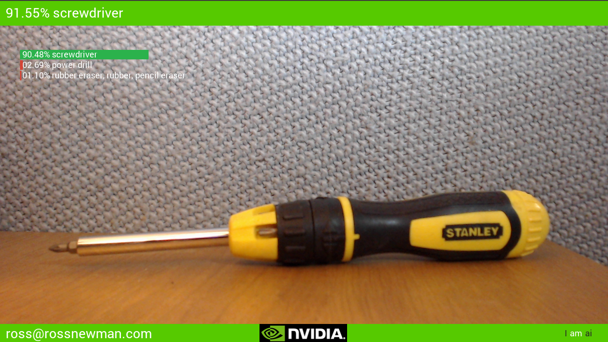
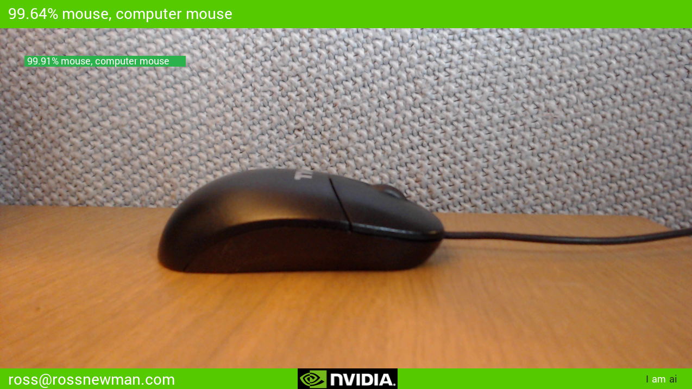

# Abaco Systems TX1 enabled Small Form Factor solutions   
## Deep Learning for Rugged Environments (Industrial / Military)
This is a branch of the NVIDIA's deep learning inference workshop and end-to-end realtime object recognition library for Jetson TX1. Please reffer to the main branch for details and tips on setting up this demonstartion.

Included in this repo are resources for efficiently deploying neural networks using NVIDIA **[TensorRT](https://developer.nvidia.com/tensorrt)**.  

Vision primitives, such as [`imageNet`](imageNet.h) for image recognition and [`detectNet`](detectNet.h) for object localization, inherit from the shared [`tensorNet`](tensorNet.h) object.  Examples are provided for streaming from live camera feed and processing images from disk. 

 for more information on source images goto (http://image-net.org/)

## Support for USB webcam and GiGEVision
On the Abaco Systems SFF box there is no CSI camera so [`gstCamera`](camera/gstCamera.h) has been modified to support the Logitech C920 Webcam. At the moment only imagenet-camera.cpp has been tested and proven to work with this modification. 

Modified pipelines can be supplied to the create function to support cameras using RGB colour space. The included pipeline in [`imagenet-camera.cpp`](imagenet-camera/imagenet-camera.cpp)  for the C920 is shown below:

    video/x-raw, width=(int)640, height=(int)480, format=RGB ! videoconvert ! video/x-raw, format=RGB ! videoconvert ! appsink name=mysink

### Logitech C920 HD USB webcam:


> **note** : Set VIDEO_SRC to GST_V4L_SCR to use your RGB webcamera as an input source.

### ptGrey GigEVision Blackfly camera:


> **note** : Set VIDEO_SRC to GST_GV_STREAM_SCR to use GigEVision cameras.

Set VIDEO_SRC to VIDEO_NV revert to the Jetson TX1 evaluation on board CSI camera.
## Goals
The aim of this project is to create a network trained on images that come from military applications such at Air / Sea / Land. Updating the network to work with this updated network for demonstration and as an example to a defence audiance. 

Please be patient whilst we build our DIGITS server to retrain the network and watch this space.

- [x] [`imagenet-camera.cpp`](imagenet-camera/imagenet-camera.cpp) updated to use webcam
- [x] [`detectnet-camera.cpp`](detectnet-camera/detectnet-camera.cpp) updated to use webcam
- [x] parametrize requested USB resolution (Default fixed at 1280 x 720)
- [x] Add suport for GigE Vision Cameras using the Aravis libaraies.
- [x] GigEVision RGB8 colorspace support
- [x] GigEVision YUV422  colorspace support
- [x] GigEVision Bayer8 colorspace support. 
- [ ] update training data (military images)
- [x] update GUI to run in window and toggle to fullscreen (fill screen)
- [x] update GUI to use SDL2
- [x] update GUI fonts to SDL2_ttf
- [ ] add RTP video streaming source for YUV encoded video streams. Injest progressive GVA (Generic Vehicle Architecture) compliant video sources.
- [ ] Code tidys up, remove redundant depedencies.

## Building from Source
Provided along with this repo are TensorRT-enabled examples of running Googlenet/Alexnet on live camera feed for image recognition, and pedestrian detection networks with localization capabilities (i.e. that provide bounding boxes). 

The latest source can be obtained from [GitHub](http://github.com/ross-abaco/jetson-inference) and compiled onboard Jetson TX1.

> **note**:  this [branch](http://github.com/ross-abaco/jetson-inference) is verified against 
>        JetPack 2.3 / L4T R24.2 aarch64 (Ubuntu 16.04 LTS) and JetPack 2.3.1 / L4T R24.2.1 aarch64 (Ubuntu 16.04 LTS)
      
#### 1. Cloning the repo
To obtain the repository, navigate to a folder of your choosing on the Jetson.  First, make sure git and cmake are installed locally:

``` bash
sudo apt-get install git cmake
```

Then clone the jetson-inference repo:
``` bash
git clone http://github.org/Abaco-systems/jetson-inference
```

#### 2. Configuring

When cmake is run, a special pre-installation script (CMakePreBuild.sh) is run and will automatically install any dependencies.

``` bash
mkdir build
cd build
cmake ../
```

#### 3. Compiling

Make sure you are still in the jetson-inference/build directory, created above in step #2.

``` bash
cd jetson-inference/build			# omit if pwd is already /build from above
make
```

For jetson 64bit builds the architecte will be aarch64, with the following directory structure:

```
|-build
   \aarch64		    (64-bit)
      \bin			where the sample binaries are built to
      \include		where the headers reside
      \lib			where the libraries are build to
```

#### 4. GigEVision additional steps (Optional step for GigE support)
For GigEVision camera support please download and compile the Aravis 0.6 release.
``` bash
git clone https://github.com/AravisProject/aravis
```
Once built do
``` bash
make install
```
Header files and library objects should not allow you to compile the code with GigEVision support. Configure camera in [`config.h`](config.h)
## Screenshots
### Webcam Input 


### GigEVision Camera Input


## Runtime
The font file and binary images used can be found in /data and should be copied into the working directort. 

* q = Quit application
* f = Toggle fullscreen
* SPACE = Toggle overlay (imagenet-camera only)

### Notes on Ethernet jitter (GigEVision)
For testing (on the Jetson TX1) I selected an Intel PCIe Ethernet NIC device that has deeper buffers and can allows pause frames to be disabled. To optimise your network interface device please run the script jetson-ethernet found in the jetson-scripts project under Abaco Systems. Example streams using external NIC:

* RGB8 encoded video streams at 1280x720@30Htz, total bandwidth consumed is aproximatly 82.2 Mb / Sec. [SampleOutput-RGB8.png](/abaco/SampleOutput-RGB8.png) best for quality.
* YUV422 encoded video streams at 1280x720@30Htz, total bandwidth consumed is aproximatly 52.4 Mb / Sec. [SampleOutput-YUV422.png](/abaco/SampleOutput-YUV422.png)
* BAYER GR8 encoded video streams at 1280x720@30Htz, total bandwidth consumed is aproximatly 27.4 Mb / Sec. [SampleOutput-Bayer_GR8.png](/abaco/SampleOutput-Bayer_GR8.png) lowest bandwidth. Can achieve 1920x1080@30Htz 61.0 Mb / Sec.

The sample output supplied is a test card encoded using each of the three color spaces. Bayer has a few different formats we are only testing GR8 (requires CUDA kernel for each to convert video).

> **note** : The YUV422 and Bayer GR8 CUDA convesion functions are not optimal and could be improved!!.

## Links
* [Abaco Systems](http://abaco.com)
* [eLinux TX1](http://elinux.org/Jetson_TX1)
* [Nvidia devtalk](https://devtalk.nvidia.com/default/board/164/)
* [Abaco Systems MC10K1 - Tegra TK1 Mini COM Express module](https://www.abaco.com/products/mcom10-k1-mini-com-express)
* [Abaco Systems GRA113 - Maxwel GPGPU 3U VPX](https://www.abaco.com/products/gra113-graphics-board)


