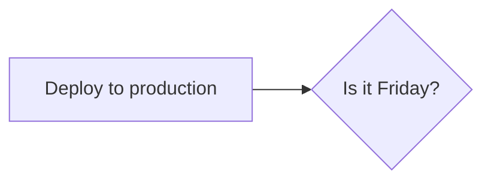
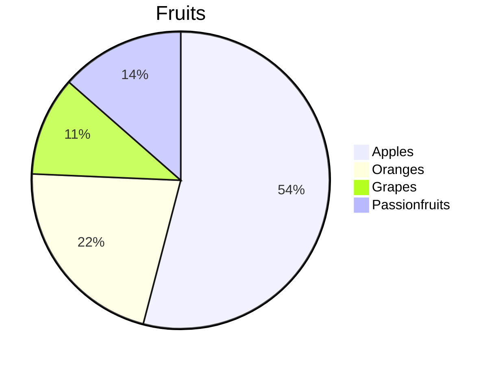

<p align="right"><sup><a href="webrtc-dash.md">Plotly Dash</a> | <a href="aux-streaming.md">Next</a> | </sup><a href="../README.md#hello-ai-world"><sup>Contents</sup></a>
<br/>
<sup>WebApp Frameworks</sup></s></p>

# Recognizer - Interactive Training

The Recognizer is a Flask-based video tagging/classification webapp with interactive data collection and training.  As video is tagged and recorded, an updated model is incrementally re-trained in the background with PyTorch and then used for inference with TensorRT.  Both inference and training can run simultaneously, and the re-trained models are dynamically loaded in for inference.


It also supports multi-label tagging, and in addition to recording client video over WebRTC, existing images can be uploaded from the client. The main source files for this example are as follows:

  * [`app.py`](../python/www/recognizer/app.py) (webserver)
  * [`stream.py`](../python/www/recognizer/stream.py) (WebRTC streaming thread)
  * [`model.py`](../python/www/recognizer/model.py) (DNN inferencing + PyTorch training)
  * [`dataset.py](../python/www/recognizer/dataset.py) (Data tagging + recording)
  * [`index.html`](../python/www/recognizer/templates/index.html) (frontend presentation)

## Running the Example

Launching app.py will start a Flask webserver, a streaming thread that runs WebRTC and inferencing, and a training thread for PyTorch:

``` bash
$ cd jetson-inference/python/www/recognizer
$ pip3 install -r requirements.txt
$ python3 app.py --data=data/my_dataset
```

> **note**: receiving browser webcams requires [HTTPS/SSL](webrtc-server.md#enabling-https--ssl) to be enabled

The `--data` argument sets the path where your dataset and models are stored under.  After running app.py, you should be able to navigate your browser to `https://<JETSON-IP>:8050` and start the stream.  The default port is 8050, but you can change that with the `--port=N` command-line argument.  It's also configured by default for WebRTC input and output, but if you want to use a different [video input device](aux-streaming.md#input-streams), you can set that with the `--input` argument (for example, `--input=/dev/video0` for a V4L2 camera that's directly attached to your Jetson).

### Collecting Data

If needed first select a client camera from the stream source dropdown on the webpage, and press the `Send` button.  When ready, enter class tag(s) of what the camera is looking at in the Tags selection box.  Once a tag is entered, you'll be able to either Record or Upload images into the dataset.  You can hold down the Record button to capture a video sequence.

It's recommended to keep the distribution of tags across the classes relatively even.  You can view the label distribution and number of images in the dataset by expanding the `Training` dropdown.

### Training

As you add and tag new data, training can be enabled under the `Training` dropdown.  The training progress and accuracy will be updated on the page.  At the end of each epoch, if the model has the highest accuracy it will be exported to ONNX and loaded into TensorRT for inference.  

### Inference

Inference can be enabled under the `Classification` dropdown.  When multi-label classification is being used (i.e. the dataset contains images with multiple tags), all classification results will be shown that have confidence scores above the threshold that can be controlled from the page.






<p align="right">Next | <b><a href="aux-streaming.md">Camera Streaming and Multimedia</a></b>
<br/>
Back | <b><a href="webrtc-dash.md">Plotly Dash</a></p>
</b><p align="center"><sup>© 2016-2023 NVIDIA | </sup><a href="../README.md#hello-ai-world"><sup>Table of Contents</sup></a></p>
